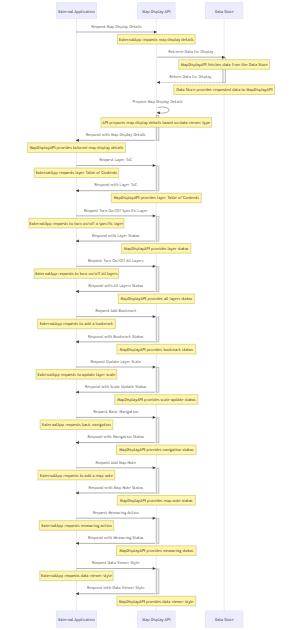

# 7 Data Structures


This section provides information on the core data structures/data models that are used by a Building Block. These data structures describe information that is exchanged between building blocks - they do not dictate internal data structures for a particular implementation. These data structures should also describe the _minimum_ set of information that should be passed in an API call. The data structures can be extended for particular use cases.

For each data model, the following information should be provided:

* Name
* Description
* Fields - the various fields in this data structure. Each field definition should contain the following:
  * Name
  * Type (string, Boolean, number, date, etc)
  * Description
  * Foreign Key (does this field reference another data structure)
  * Constraints (does the field need to be unique, is it the primary key)
  * Required (Y/N)
  * You can also reference any standards that must be adhered to (ie. UTC standard for date/times)

**Resource Model:** This section may also include a resource model diagram which shows the relationship between data objects that are used by this Building Block.


_\<Example Data Elements>_

## 7.1 Map Display

### 7.1.1 Map Display Resource Model

<figure><figcaption>
<a href="https://drive.google.com/file/d/1EbdwOnPMpCHPEnjInAgOBco4TaYTh-xt/view?usp=sharing">Diagram Source</a>
</figcaption></figure>

### 7.1.2 Map Display: Data Elements

**7.1.2.1 MapDisplay**

<table><thead><tr><th width="166">Field</th><th width="205">Type</th><th width="205">Description</th><th>Notes</th></tr></thead><tbody><tr><td>Title</td><td>String</td><td>The title of the map display.</td><td></td></tr><tr><td>Description</td><td>String</td><td>A summary description of the map display, purpose and contents.</td><td></td></tr><tr><td>Attribution</td><td>String</td><td>Information or credits displayed on the map.</td><td>Optional</td></tr><tr><td>AccessControl </td><td>Boolean</td><td>Permissions or access restrictions for the map.</td><td></td></tr><tr><td>EndPoint</td><td>String{url}</td><td>The URL or endpoint to access the API</td><td></td></tr><tr><td>CRS</td><td>String{coded_domain}</td><td>Code for the spatial reference system used by the map</td><td>Refer to OGC API Map Part II:  <a href="https://docs.ogc.org/is/18-058/18-058.html">https://docs.ogc.org/is/18-058/18-058.html</a></td></tr><tr><td>Center_X</td><td>Real</td><td>The longitude coordinate of the center point of the map</td><td>Optional</td></tr><tr><td>Center_Y</td><td>Real</td><td>The latitude coordinate of the center point of the map</td><td>Optional</td></tr><tr><td>Bounds_MinX</td><td>Real</td><td>The longitude coordinate of the lower left point of the map bounding box</td><td></td></tr><tr><td>Bounds_MinY</td><td>Real</td><td>The latitude coordinate of the lower left point of the map bounding box</td><td></td></tr><tr><td>Bounds_MaxX</td><td>Real</td><td>The longitude coordinate of the upper right point of the map bounding box</td><td></td></tr><tr><td>Bounds_MaxY</td><td>Real</td><td>The latitude coordinate of the upper right point of the map bounding box</td><td></td></tr></tbody></table>

**7.1.2.2 Navigation**

<table><thead><tr><th width="166">Field</th><th>Type</th><th width="205">Description</th><th>Notes</th></tr></thead><tbody><tr><td>Zoom</td><td>Boolean</td><td>Specifies if zooming is supported</td><td></td></tr><tr><td>ZoomLevel</td><td>Integer</td><td>The available zoom levels for the map</td><td>Refer to OGC API Map Part I: <a href="https://docs.ogc.org/is/20-057/20-057.html">https://docs.ogc.org/is/20-057/20-057.html</a></td></tr><tr><td>Pam</td><td>Boolean</td><td>Specifies if panning is supported</td><td></td></tr></tbody></table>

**7.1.2.3 SpatialBookmark**

**7.1.2.4 MapNote**

**7.1.2.5 Measuring**

**7.1.2.6 LayerToC**

**7.1.2.7 Layer**

**7.1.2.8 ScaleLimit**

**7.1.2.9 Style**

**7.1.2.10 DataViewer**

## 7.2 GIS Query

## 7.3 GIS Data Management

## 7.4 Geocoding and Reverse Geocoding

## 7.5 Spatial Awareness and Analysis&#x20;

## 7.6 Reporting

## 7.7 Geofencing

## 7.8 Routing
