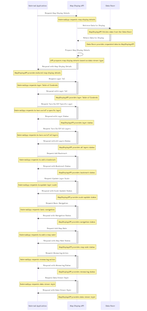
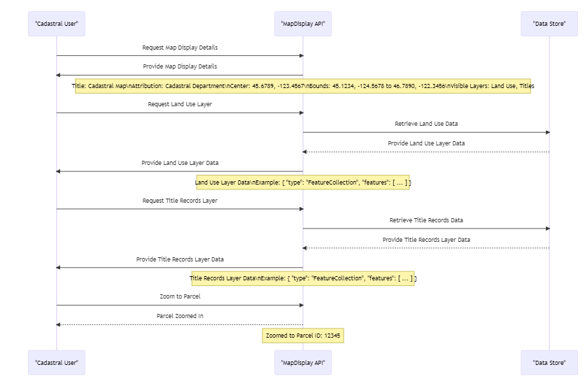
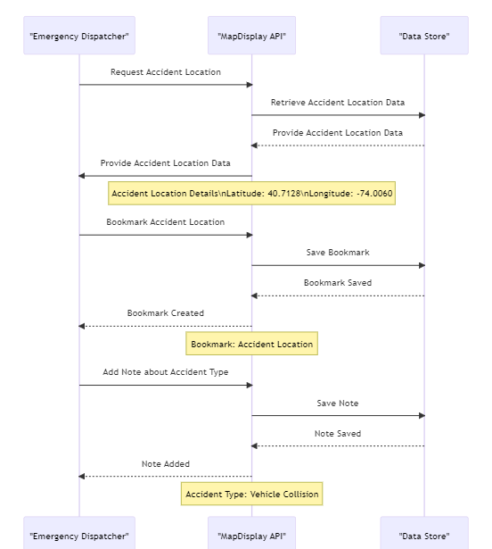

# 9 Internal Workflows

The following internal workflows describe the processes the GIS Building Block executes to fulfill a request from an external application or Building Block to meet the functional requirements stated in Section 6 of this specification. In the current scope, examples are drawn from the user-journey steps of the use-cases of the GIS-Based Incident Management System and Land Records/Cadaster Management provided in Section 2. The below common preconditions should be met before utilizing the GIS BB Services:

* **Information Mediator BB Configuration**: All the service endpoints of the GIS BB APIs should be configured in the Information Mediator BB.
* **Conformance to Open Standards:** Developers of the GIS BB APIs should adhere to the [OGC web API guidelines and principles](https://github.com/opengeospatial/OGC-Web-API-Guidelines), and Cross-Origin Resource Sharing (CORS) to enable seamless integration and data exchange of GIS data between GIS BB APIs and GIS API services offered by other systems.
* **Data Format Compatibility:** The geospatial data source handled by the GIS BB APIs, whether vector data (points, lines, and polygons) or raster data (imagery, elevation data), should be in a format compatible with the specific API used (e.g., GeoJSON, GML, KML, etc.) per Section 7 of this specification.
* **Coordinate System Awareness:** Developers and users should understand the coordinate system and projections used in their geospatial data to prevent inaccuracies in analysis and visualization.
* **No Authentication or API Keys:** As a general rule, developers of the GIS BB APIs should avoid mandatory authentication mechanisms or API keys that can limit access; make the API accessible to anyone without a signup process unless there is a legitimate requirement to impose authentication mechanisms.

### 9.1 GIS Map Display

#### 9.1.1 Interactions between an external application or a Building Block and the MapDisplay API with data store integration

<figure><figcaption></figcaption></figure>

#### 9.1.1  Example 1: Cadastral User Displaying Land Use and Title Layers with Parcel Zoom

<figure><figcaption></figcaption></figure>

#### 9.1.2  Example 2: Emergency Dispatcher: Accident Location Bookmarking and Map Note Addition

<figure><figcaption></figcaption></figure>

